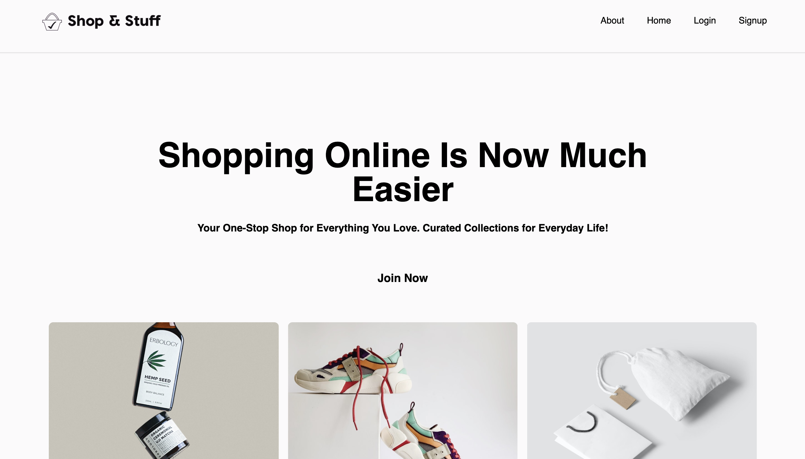

# Shop & Stuff - E-Commerce Application

## Overview

A modern e-commerce web application built with React, Redux, and React Router. This app features user authentication, product details, shopping cart functionality, and a seamless checkout process.

## Features

- **User Authentication**: Registration and login functionalities.
- **Product Display**: View detailed information about products.
- **Shopping Cart**: Add products to a shopping bag and proceed to checkout.
- **Checkout Process**: Complete payment and view success message.
- **About Page**: Learn more about the application.

## 🖥️ Demo Preview




---

## Installation

1. **Clone the repository**:
   ```bash
   git clone https://github.com/jyo-02/shopnstuff-demo
   ```
2. **Navigate to the project directory**:
   ```bash
   cd shopnstuff-main
   ```
3. **Install dependencies**:
   ```bash
   npm install
   ```

   ## Usage

1. **Start the server**:
   ```bash
   npm start
   ```
2. **Open your browser** and visit `http://localhost:5173`.

## Technologies Used

- **Frontend**: React
- **Backend**: Node.js, Express
- **Database**: MongoDB